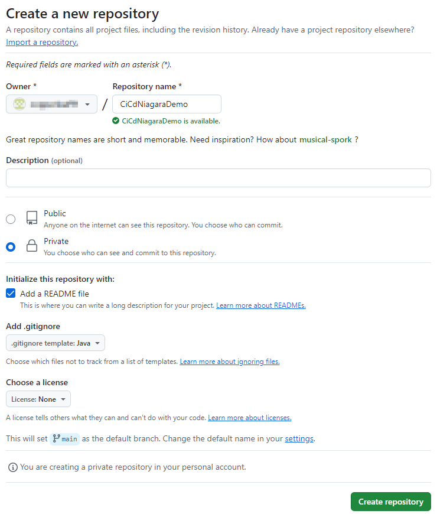

# 2025 Niagara Forum CICD Demo


## Services and Tools Used
| Tool                                                                      | Description                                                                             |
|---------------------------------------------------------------------------|-----------------------------------------------------------------------------------------|
| [Niagara](https://www.tridium.com/us/en/Products/niagara)                 | Niagara	The one and only best building management framework of all time. No bias here.  |
| [Github](https://github.com/)                                             | A popular source code repository that can also be used for build environements using Github Actions. |
| [owasp-dependency-check](https://owasp.org/www-project-dependency-check/) | A software composition analysis tool similar to Blackduck Hub that can be used to identify open source components and known vulnerabilities in those components. |
| [Spotbugs](https://spotbugs.github.io/)                                   | A static code analsysis similar to Sonarcube and Coverity that can be used to identified software coding issues. |
| [Jacoco](https://www.jacoco.org/jacoco/)                                  | A code coverage tool that works with unit tests to assess if the unit tests exercise the application code. |
| [Ansible](https://docs.ansible.com/ansible/latest/index.html)             | A tool used for helping create repeatable, non-repudiated environments. For example, github runners.

## Tasks

> _**Pro Tip**_ If you are behind a proxy server, it may be necessary to configure your proxy settings.
```bash
sudo cat >> /etc/apt/apt.conf.d/05proxy << EOF
Acquire::http::proxy "http://proxy.honeywell.com:80";
Acquire::https::proxy "http://proxy.honeywell.com:80";
Acquire::ftp::proxy "http://proxy.honeywell.com:80";
EOF

sudo cat >> /etc/environment << EOF
export HTTP_PROXY=http://proxy.honeywell.com:80
export HTTPS_PROXY=http://proxy.honeywell.com:80
export http_proxy=http://proxy.honeywell.com:80
export https_proxy=http://proxy.honeywell.com:80
EOF
```

### Create a Github Repo



### Install Niagara

First, install any dependencies and get the system up-to-date.

```bash
sudo apt update
sudo apt upgrade
sudo apt install unzip
sudo apt install tofrodos
```

Once your environment is ready, download and install your Niagara instance. Make sure to add your user to the 'niagara' group as well as install and start the niagara daemon.

```bash
wget https://artifactory-na.honeywell.com:443/artifactory/tridium-release-candidates-maven-stable-local/com/tridium/niagara/image/Tridium_N4_Supervisor_Linux_x64/4.15.0.122-RC/Tridium_N4_Supervisor_Linux_x64-4.15.0.122-RC.zip
unzip Tridium_N4_Supervisor_Linux_x64-4.15.0.122-RC.zip
chmod +x ./install.sh
sudo ./install.sh
```

Once installed, you will need to install a Niagara license. This can be done by connecting with Workbench. In addition, you ca get the host id with

```bash
# initialize environment
. /opt/Niagara/Niagara=4.15.0.122/bin/.niagara

# get host id
nre -hostid
```

### Install a Github Runner

TBD

> _**Pro Tip**_ When creating your runner, give it an extra tag like "Niagara" to help identify runners that have Niagara installed.

### Install Any Tool Dependencies

#### Powershell

Powershell is used by the xxx Github action and needs to be installed.
https://learn.microsoft.com/en-us/powershell/scripting/install/install-ubuntu?view=powershell-7.5

```bash
sudo apt-get install -y wget apt-transport-https software-properties-common
source /etc/os-release
wget -q https://packages.microsoft.com/config/ubuntu/$VERSION_ID/packages-microsoft-prod.deb
sudo dpkg -i packages-microsoft-prod.deb
rm packages-microsoft-prod.deb
sudo apt-get update
sudo apt-get install -y powershell
```

## Enhancements

- **Runner deployment script** - developing a script to help repeat a consistent deployment to multiple runners.
- **HSM integration** - developing an integration with Azure KeyVault or AWS AKM for an HSM backed keystore.
- **Auto Version Bumping** - Auto increment the build version number with each "release" build with a tool like bump-my-version.
- **Build Container** - Create a build container that has all the tools installed to make it easier to deploy.